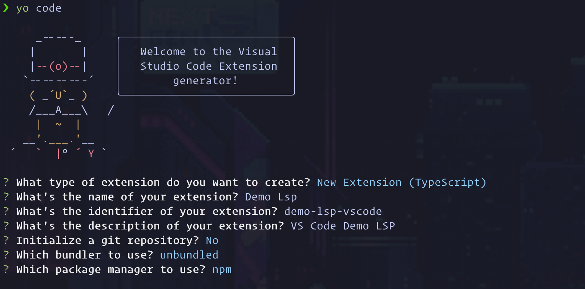

Its time to talk to hook up our editor VS Code edition!
Unortunately, hooking up the LSP to the editor is a bit more involved than the previous steps with neovim. 

To speed things along here we are going install `Yaemon` which is a multi purpose code generator. 

```bash
npm i -g yo generator-code
yo code
```

You will be brought through a series of questions. 
You can answer however you like, I prefer typescript so that's what I used and gave it a generic name.



After your project has been generated, we need to add one more dependency for developing the LSP Client.

```bash
npm i vscode-languageclient
````


