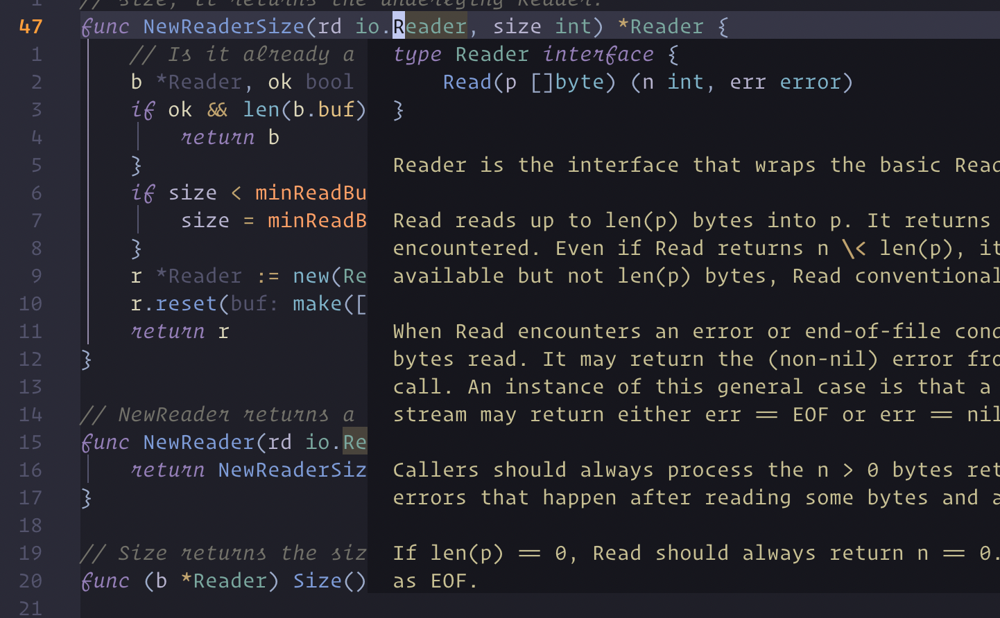

Next up is implementing the `textDocument/Hover` method.
This method is called when the user hovers over a symbol in the editor, or for neovim users a user might press `K` in normal mode.
The server should respond with a hover object that contains the hover information.

Lets checkout Microsofts **[documentation on the hover method](https://microsoft.github.io/language-server-protocol/specifications/lsp/3.17/specification/#textDocument_hover).**
Skip the client capabilities and the response part for now.
We see that the request `HoverParams` extends two other types `TextDocumentPositionParams` and `WorkDoneProgressParams`.
So we know we need to create these interfaces, 
