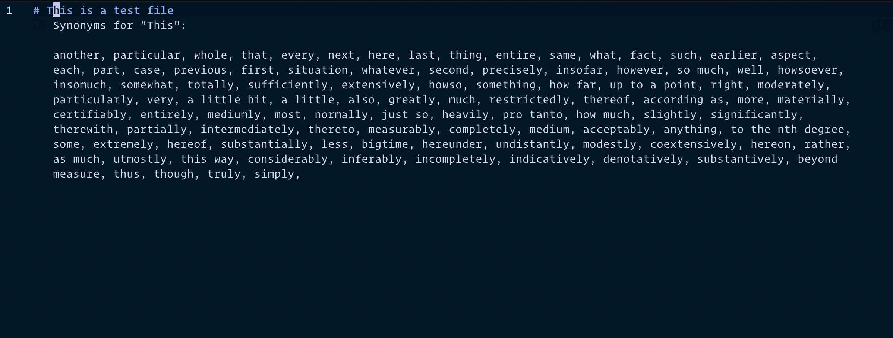

Lastly we're going to user our hover event to return synonyms of words in markdown files. 
Usually when I'm writing anything I have a poor habit of using the same words and end up going from text editor to google often.
Looking up the synonyms is meant to represent what we would do if we were actually looking up definitions and syntax from the compiler/codebase.

Lets create a `lookup.go` file to handle the synonyms.
```bash
touch thesaurus/lookup.go
```

```go  title="thesaurus/lookup.go"
package thesaurus

import (
	"encoding/json"
	"fmt"
	"io"
	"net/http"
)

type Synonyms struct {
	Word string `json:"word"`
}

const baseUrl = "https://api.datamuse.com"

func Lookup(word string) ([]string, error) {
	url := fmt.Sprintf("%s/words?ml=%s", baseUrl, word)

	response, err := http.Get(url)
	if err != nil {
		return nil, err
	}

	defer response.Body.Close()

	body, err := io.ReadAll(response.Body)
	if err != nil {
		return nil, err
	}

	var synonymResult []Synonyms

	err = json.Unmarshal(body, &synonymResult)
	if err != nil {
		return nil, err
	}

	var synonyms []string

	for _, synonym := range synonymResult {
		synonyms = append(synonyms, synonym.Word)
	}

	return synonyms, nil
}
```

This part is rather simple and probably doesn't require much explanation.
We're using a free api from `datamuse.com` to get the synonyms of a word.
There's actually a lot more you can do with `datamuse` and I encourage people to look more into that API.

All that's left to do is update our `main` function.

```go title="main.go" ins={5-17} del={1-3}
		// reply with the word
		hoverResponse := lsp.NewHoverResponse(*hoverRequest.Id, hoveredWord)
		writeResponse(hoverResponse, writer, logger)
		hoverResponseMsg := fmt.Sprintf("Synonyms for \"%s\": \n\n", hoveredWord)
		synonyms, err := thesaurus.Lookup(hoveredWord)
		if err != nil {
			logger.Printf("Error looking up synonyms for %s: %s\n", hoveredWord, err)
		}

		for _, synonym := range synonyms {
			hoverResponseMsg += fmt.Sprintf("%s, ", synonym)
		}

		// reply with the synonyms
		hoverResponse := lsp.NewHoverResponse(*hoverRequest.Id, hoverResponseMsg)
		writeResponse(hoverResponse, writer, logger)
```

Now, if rebuild and run our server, we should see the synonyms of the word we hover over.


