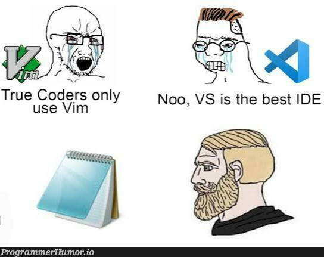

import { Aside } from '@astrojs/starlight/components';

Now we have a simple logger setup, we can start to work on encoding and decoding messages.

## Creating a Listener

We need our LSP to be listening to stdin and writing to stdout to commnicate with the client.
Go conviently provides a `bufio` package that we can use to create our listener. Lets create a new package called RPC to handle the listener and encoding and decoding of messages.

```bash
mkdir rpc && touch rpc/listener.go
```

And in the listener.go file we can add the function to create a scanner.
```go
package rpc

import "bufio"


func CreateScanner() *bufio.Scanner {

}
```
Next add the scanner with a reader of `os.Stdin`. We can also define our own split function so that we can seperate each message by the `Content-Length` header.
```go
func CreateScanner() *bufio.Scanner {
	scanner := bufio.NewScanner(os.Stdin)
	scanner.Split(SplitMessage)
	return scanner
}
```

The `SplitMessage` function will look something like this:
```go
func SplitMessage(data []byte, atEOF bool) (advance int, token []byte, err error) {
	// look for the seperator between header and content
	header, content, found := bytes.Cut(data, []byte{'\r', '\n', '\r', '\n'})

	if !found {
		return 0, nil, nil
	}

	// get the content-length
	contentLengthBytes := header[len("Content-Length: "):]
	// parse to int
	contentLength, err := strconv.Atoi(string(contentLengthBytes))
	if err != nil {
		return 0, nil, err
	}

	if len(content) < contentLength {
		return 0, nil, nil // missing content
	}

	totalLength := len(header) + contentLength + 4

	return totalLength, data[:totalLength], nil
}
```

We're taking in the current data, splitting the bytes by our seperator, determining the content length of 
the current message and if all goes well returning our full message and telling the reader to advance the length of the message in bytes.


## Encoding and Decoding Messages

Before we can start to decode messages we need to know what the messages will look like.
As discussed in the LSP specification, messages will be in the form of JSON objects with a `method` key.

So lets create some basic types to represent the messages.
```bash
mkdir lsp && touch lsp/message.go
```
```go title="lsp/message.go"
package lsp

type BaseMessage struct {
	Method string `json:"method"`
}

type Request struct {
	Id      *int   `json:"id,omitempty"`
	Jsonrpc string `json:"jsonrpc"`
	Method  string `json:"method"`
	// we will add the params when we implement
}

type Response struct {
	Id      *int   `json:"id,omitempty"`
	Jsonrpc string `json:"jsonrpc"`
	// we will either have a result or an error when we implement
}

type Notification struct {
	Method string `json:"method"`
}
```

Alright we have a scanner and some types, but we still need to be able to encode and decode the `[]byte`.

We'll start with perhaps the simpler of the two, encoding a message.
Let's create a new file in the rpc package called `operations.go`.

```bash
touch rpc/operations.go
```
```go
package rpc

import (
	"encoding/json"
	"fmt"
)

func EncodeMsg(msg any) string {
	content, err := json.Marshal(msg)
	if err != nil {
		panic("UNABLE TO ENCODE MSG")
	}

	return fmt.Sprint("Content-Length: %d\r\n\r\n%s", len(content), content)
}
```

A quick, easy function to write, next we'll create the decode function.
```go
// Goal of this function is to just determine the method of the message,
// if it's a valid message and return the content of the message
// This way we can unmarshall the content of the message into the correct struct
func DecodeMsg(msg []byte) (string, []byte, error) {
	// Takes a message and decodes to a struct
	header, content, found := bytes.Cut(msg, []byte{'\r', '\n', '\r', '\n'})

	if !found {
		return "", nil, errors.New("Header not found")
	}

	// Parse the header
	contentLengthStr := header[len("Content-Length: "):]
	contentLength, err := strconv.Atoi(string(contentLengthStr))
	if err != nil {
		return "", nil, err
	}

	// Determine the method
	var baseMessage lsp.BaseMessage

	if err := json.Unmarshal(content[:contentLength], &baseMessage); err != nil {
		return "", nil, err
	}

	return baseMessage.Method, content[contentLength:], nil
}
```

## Testing our operations

Before continuing, lets do a quick sanity test and make sure our operations are working as expected.

```bash
touch rpc/operations_test.go
```

```go
package rpc_test

import (
	"demo_lsp/rpc"
	"fmt"
	"testing"
)

type SomeMessage struct {
	MessageName string `json:"messageName"`
}

func TestEncodeMsg(t *testing.T) {
	expected := "Content-Length: 22\r\n\r\n{\"messageName\":\"test\"}"
	actual := rpc.EncodeMsg(SomeMessage{MessageName: "test"})

	if expected != actual {
		t.Fatalf("TestEncodeMsg did not properly encode expected: %s actual: %s", expected, actual)
	}
}

func TestDecodeMsg(t *testing.T) {
	// arrange
	testContent := "{\"method\":\"someMethod\"}"
	testMessage := fmt.Sprintf("Content-Length: 23\r\n\r\n%s", testContent)

	// act
	method, content, err := rpc.DecodeMsg([]byte(testMessage))
	// assert
	if err != nil {
		t.Fatal(err)
	}

	if method != "someMethod" {
		t.Fatalf("Method: %s did not equal \"someMethod\"", method)
	}

	if string(content) != testContent {
		t.Fatalf("Content: %s did not equal testContent: %s", content, testContent)
	}
}
```
```bash
go test rpc/operations_test.go
```

Hopefully the testing gods have looked favorably upon us with a passing test: `ok      command-line-arguments  0.264s`

## Tying it all together

Lets piece our rpc implementation together in our main function.

```go title="main.go"  ins={4,16-23, 26-38}
package main

import (
	"demo_lsp/rpc"
	"fmt"
	"log"
	"os"
	"path/filepath"
	"time"
)

func main() {
	logger := getLogger(nil)
	logger.Println("Hey buddy, I started")

	// Setup scanner
	scanner := rpc.CreateScanner()

	for scanner.Scan() {
		// Listener loop
		msg := scanner.Bytes()
		handleMessage(msg, logger)
	}
}

func handleMessage(msg []byte, logger *log.Logger) {
	method, content, err := rpc.DecodeMsg(msg)
	if err != nil {
		logger.Printf("In \"handleMessage\" Error decoding message: %s \n", err)
		return
	}

	switch method {
	case "initialize":
		logger.Println("initialize")
		logger.Printf("Content: %s\n", content)
	}
}

...
```

Pretty simple we have a handleMessage function that will decode the message and then switch on the method to determine what to do with the message.
Next for the exciting part of making contact with our editor 👽.

## But which editors are we going to use?



<Aside>
    I use and prefer neovim, so I will continue with setting up neovim with our LSP but I have included a VS Code setup as well.
    Neovim allows me to move a bit faster than the VS Code version so I feel it is better for demonstration purposes.
</Aside>
