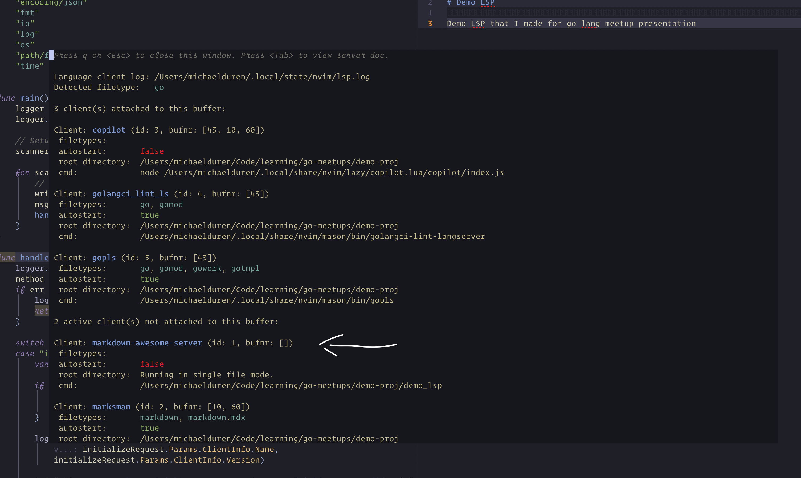

So great, we've got a connection, well partial connection. We've received a message from our editor but we haven't yet agreed on what we're going to do with it.
We need to agree on what capabilities we both have and what protocols we're going to use to communicate.

This is not called the handshake specifically I just liked that for a title for this part.
Anyway, we've received a message and logged it, but now we need to first decode it and then respond.

## Creating the Initialize Types

In order to this we'll make a simplified struct representing the message and then we'll implement the decoding and encoding for it.
Let's checkout the docs for the structure of the [Initialize Request](https://microsoft.github.io/language-server-protocol/specifications/lsp/3.17/specification/#initialize).
If we scroll down to the `InitializeParams` we can see that it has a decent amount of information, for our purposes we don't need all of it.
We'll make a couple structs to grab what we want from this.

```bash
touch lpc/initialize.go
```

```go title="lpc/initialize.go"
package lsp

type Initialize struct {
	Request
	Params InitializeParams `json:"params"`
}

type InitializeParams struct {
	ClientInfo ClientInfo `json:"clientInfo"`
}

type ClientInfo struct {
	Name    string `json:"name"`
	Version string `json:"version"`
}
```

Next let's make some types to represent the Initialize Result to complete the handshake.
Following the same strategy we can checkout the docs for the [Initialize Response](https://microsoft.github.io/language-server-protocol/specifications/lsp/3.17/specification/#initializeResult)
and create the structs to represent the response.

```go title="lpc/initialize.go" ins={5-44}

package lsp

... previous code ...

type InitializeResponse struct {
	// this is the first message that the server sends to the client
	Response
	Result InitializeResult `json:"result"`
}

type InitializeResult struct {
	ServerInfo   ServerInfo         `json:"serverInfo"`
	Capabilities ServerCapabilities `json:"capabilities"`
}

type ServerCapabilities struct {
    // will be filled in later
}

type ServerInfo struct {
	Name    string `json:"name"`
	Version string `json:"version"`
}

func NewInitializeResponse(id int) InitializeResponse {
	return InitializeResponse{
		Response: Response{
			Id: &id,
			Message: Message{
				Jsonrpc: "2.0",
			},
		},
		Result: InitializeResult{
			Capabilities: ServerCapabilities{}, // what we're able to do
			ServerInfo: ServerInfo{
				Name:    "demo_lsp",
				Version: "0.0.0.0",
			},
		},
	}
}
```

## Decoding the Initialize Request

With our types in place, our operation functions ready to fire, lets decode the message and respond.

First, decoding we can remove the previous logging and create our object and a smaller log message.
```go title="main.go ins={5-14} del={2-3}
case "initialize":
    logger.Println("initialize")
    logger.Printf("Content: %s\n", content)

    var initializeRequest lsp.Initialize

    if err := json.Unmarshal(content, &initializeRequest); err != nil {
        logger.Printf("Error unmarshalling initialize request: %s\n", err)
        return
    }

    logger.Printf("Initialize Request by client: %s, version: %s",
        initializeRequest.Params.ClientInfo.Name,
        initializeRequest.Params.ClientInfo.Version)

    // TODO: send response to the client
}
```

Run a quick `go build`, reopen your editor and a markdown file we should see our log:
`[demo_lsp]2024/06/16 21:00:39 main.go:44: Initialize Request by client: Neovim, version: 0.10.0-dev`

## Responding to the client

Next lets respond to the client with our capabilities.
Since we're going to be responding to our client pretty often, it makes sense to write a quick helper function.

```go title="main.go" ins={5-13}
package main

... other code ...

func writeResponse(msg any, writer io.Writer, logger *log.Logger) {
	encodedMsg := rpc.EncodeMsg(msg)
	_, err := writer.Write([]byte(encodedMsg))
	if err != nil {
		logger.Printf("Error writing response: %s\n", err)
	} else {
		logger.Printf("Response sent: %s\n", encodedMsg)
	}
}
```

The code here is pretty straight forward, I've added a log statement even if we don't get an error, this is just for debugging purposes.
Our `writeResponse` function takes a message, a writer and a logger. It encodes the message, writes it to the writer and logs the message.
Using the `io.Writer` interface helps us to be more flexible with what we can write to, but also makes it easier to unit test since we can easily mock the interface.

Next we can update our `handleFunc` and `main` functions.
```go title="main.go" ins={8,24,26,50,51}
package main

import (
	"demo_lsp/lsp"
	"demo_lsp/rpc"
	"encoding/json"
	"fmt"
	"io"
	"log"
	"os"
	"path/filepath"
	"time"
)

func main() {
	logger := getLogger(nil)
	logger.Println("Hey buddy, I started")

	// Setup scanner
	scanner := rpc.CreateScanner()

	for scanner.Scan() {
		// Listener loop
		writer := os.Stdout
		msg := scanner.Bytes()
		handleMessage(msg, writer, logger)
	}
}

func handleMessage(msg []byte, writer *os.File, logger *log.Logger) {
	method, content, err := rpc.DecodeMsg(msg)
	if err != nil {
		logger.Printf("In \"handleMessage\" Error decoding message: %s \n", err)
		return
	}

	switch method {
	case "initialize":
		var initializeRequest lsp.Initialize

		if err := json.Unmarshal(content, &initializeRequest); err != nil {
			logger.Printf("Error unmarshalling initialize request: %s\n", err)
			return
		}

		logger.Printf("Initialize Request by client: %s, version: %s",
			initializeRequest.Params.ClientInfo.Name,
			initializeRequest.Params.ClientInfo.Version)

		initializeResponse := lsp.NewInitializeResponse(*initializeRequest.Id)
		writeResponse(initializeResponse, writer, logger)
	}
}

func writeResponse(msg any, writer io.Writer, logger *log.Logger) {
	encodedMsg := rpc.EncodeMsg(msg)
	_, err := writer.Write([]byte(encodedMsg))
	if err != nil {
		logger.Printf("Error writing response: %s\n", err)
	} else {
		logger.Printf("Response sent: %s\n", encodedMsg)
	}
}

... other code ...
```

As we did before lets build and run our server. `go build` and open your choice of markdown file.
If we check the logs we see that we've sent a response to the client.
`[demo_lsp]2024/06/17 20:38:47 main.go:62: Response sent: Content-Length: 202
`.
However, how do we know that the client has received our message for sure? Just because we didn't an error doesn't mean everything went smoothly.

## Logging Notifications

We know so far we are splitting each message successfully, why not just log the results?
In our `handleMessage` function lets just simply add a line to log any kind of message:

```go ins={2}
func handleMessage(msg []byte, writer *os.File, logger *log.Logger) {
	logger.Printf("Message received: %s\n", msg)
	method, content, err := rpc.DecodeMsg(msg)
	if err != nil {
		logger.Printf("In \"handleMessage\" Error decoding message: %s \n", err)
		return
	}
    ...
}
```

I'm sure you can guess what to do next to test this. After rebuilding, we can see something very important:
`{"method":"initialized","params":{},"jsonrpc":"2.0"}`. With this we've received the clients information, 
notified the client of what capabilities we can can provide and the client has acknowledged this.

We are ready to actually start implementing IDE features!

One more check we can make is to check the lest of running language servers, in neovim we can do this by running the command `:LspInfo`,
`TODO:`
VS Code information goes here.


