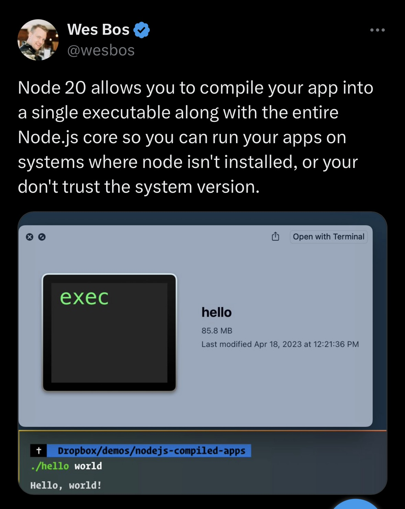
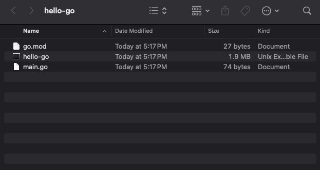

import BigLink from '../../../components/BigLink.astro'
import { Card } from "@astrojs/starlight/components";

<Card icon="information" title="Website to Follow Along">
  <BigLink href="https://go-lsp.michaelduren.com/" title="https://go-lsp.michaelduren.com/" />
</Card>

## What is LSP?

From the official [LSP website](https://microsoft.github.io/language-server-protocol/):

> Adding features like auto complete, go to definition, or documentation on hover for a programming language takes significant effort. Traditionally this work had to be repeated for each development tool, as each tool provides different APIs for implementing the same feature.
>
> A Language Server is meant to provide the language-specific smarts and communicate with development tools over a protocol that enables inter-process communication.
>
> The idea behind the Language Server Protocol (LSP) is to standardize the protocol for how such servers and development tools communicate. This way, a single Language Server can be re-used in multiple development tools, which in turn can support multiple languages with minimal effort.
>
> LSP is a win for both language providers and tooling vendors!

## Why LSP?

So this sounds awesome, but what does an implementation of LSP look like? And why would we want to implement it?

Learning how your tools work is a great way to become more efficient and effective in your work. This is especially true for developers, who spend a lot of time with their tools.

Not understanding our tools on at least some high level can cause a lot of headache when they stop working. What are IDE's doing with all these features that are invisible to us that can be involved with building, testing, or debugging our code.

Understanding how LSP works can help you understand how your editor works, and how to make it work better for you.

I personally enjoy learning about aspects of technology that are not immediately obvious, or some what mysterious in how they work.

I think pealing back the curtain or looking under the hood can be a great way to learn and grow as a developer, so while I don't plan on doing a full implementation of LSP, I think it would be fun to learn how it works and how to use it.

## Why Go Lang?

### Well as we can see above go langs hello world is a lot smaller than 85.8MB

Wes Bos, a well known web developer, recently tweeted about the size of a simple node project. 
The compiled size of a simple node project was 85.8MB. This is a lot of overhead for a simple project, and he got a LOT of responses.
Dev tools should be fast and efficient, and not take up a lot of space. 
A lot of developer tooling is open source so using a language that can be learned quickly by many is important.

Gos Langs simplicity, speed, and effeciency make it a great choice for many developer tools.

### This is a go Meetup

Kind of a no brainer to use go for this project.

### For real

Go is a great language for this kind of project. It's fast, has a great standard library, and is easy to learn. Go can also be compiled to a single binary, without long build times or dependencies.

